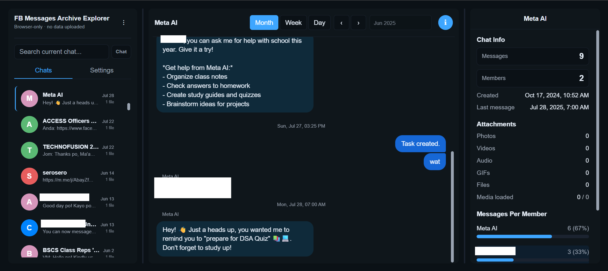

# FB Messages Archive Explorer

Browse, search, and manage your exported Facebook or Messenger message archive privately, in your browser, with nothing uploaded.

**[🔗 Open the App](https://serogee.github.io/FB-Messages-Archive-Explorer/)**

> **Your data stays on your computer.** All processing happens in your browser. Your messages and files are never uploaded anywhere.

---

## Contents

- [🚀 1. Quick Start](#1-quick-start)
- [🖥️ 2. Demo](#2-demo)
- [🔍 3. Features](#3-features)
- [❓ 4. How to Export Your Messages](#4-how-to-export-your-facebook-or-messenger-messages)
    - [4.1. Option A: Facebook](#41-option-a-facebook-all-facebook-messages)
    - [4.2. Option B: Messenger](#42-option-b-messenger-standalone-messenger-export)
    - [4.x. Which folder structure does the app recognize?](#4x-which-folder-structure-does-the-app-recognize)
- [❔ 5. Browser Support and Limitations](#5-browser-support-and-limitations)
- [⚙️ 6. Run the App Locally](#6-run-the-app-locally)
    - [6.1. Prerequisites](#61-prerequisites)
    - [6.2. Setup](#62-setup)
    - [6.3. Build for Production](#63-build-for-production)
    - [6.4. Other Developer Commands](#64-other-developer-commands)
- [🤖 7. Tech Stack](#7-tech-stack)
- [🔏 8. Privacy and Data Handling](#8-privacy-and-data-handling)
- [🔗 9. Related Project and Credits](#9-related-project-and-credits)
- [📜 10. License](#10-license)
- [📡 11. Contact and Support](#11-contact-and-support)

---

<a name="1-quick-start"></a>
## 🚀 1. Quick Start

Before you begin, you need a Facebook or Messenger export in **JSON format** (not HTML). See [How to Export Your Messages](#4-how-to-export-your-facebook-or-messenger-messages) for step-by-step instructions.

1. Download your Facebook or Messenger export from Meta.
2. **Extract** (unzip) the downloaded `.zip` file to a folder on your computer.
3. Open the app: **[https://serogee.github.io/FB-Messages-Archive-Explorer/](https://serogee.github.io/FB-Messages-Archive-Explorer/)**
4. Click **Open Folder** in the sidebar.
5. Select the folder you extracted. You can select:
    - The whole extracted folder (the app finds the messages automatically), or
    - The `messages` folder inside it.
6. Wait for your chats to finish loading. A progress bar shows the status.
7. Click any chat in the sidebar to read it.

**If the app shows an error and does not recognize your folder:**

- Make sure you extracted the `.zip` file first. The app cannot open `.zip` files directly.
- Make sure you chose **JSON** format when you exported. HTML exports are not supported.

**About write access:** Normal viewing is read-only. The app only asks for write access if you turn on chat deletion in Settings. You do not need write access to browse, search, or save attachments.

---

<a name="2-demo"></a>
## 🖥️ 2. Demo



---

<a name="3-features"></a>
## 🔍 3. Features

**Viewing**

- Load a complete Facebook export or a Messenger standalone export and see all your conversations
- View inbox, archived threads, and message request conversations separately
- Read messages in a Messenger-like layout with chat bubbles and date headers
- View images, videos, GIFs, audio messages, and file attachments inline
- See emoji reactions on messages

**Searching and Navigating**

- Filter the chat list by conversation name
- Sort chats by: most recent, oldest, most messages, fewest messages, largest size, or smallest size
- Search message content within the current chat
- Search across all chats at once ("All" search mode)
- Jump to any point in a conversation using the date navigator (day, week, or month scale)
- Click a search result to jump to that message, even across different chats

**Details and Gallery**

- View per-chat statistics: message count, member count, date range, and attachment counts by type
- See how many messages each member sent, with percentage bars
- Browse all attachments in a filterable gallery (photos, videos, audio, GIFs, files)
- Select attachments and save them to a folder (Chromium browsers) or download as a ZIP file (all browsers)

**Customization**

- Choose which participant's messages appear on the right ("View perspective")
- Switch between dark mode and light mode
- Show or hide sender names and reactions
- Resize the sidebar and statistics panel by dragging

**Archive Management (optional)**

- Select one or more conversations and delete them permanently from your exported archive
- Disabled by default; requires explicit confirmation; only available in Chromium browsers

> [!WARNING]
> Deleting a conversation permanently removes its files from your computer. There is no undo, no recycle bin, and no way to recover the files. Keep your original `.zip` download as a backup before you delete anything.

---

<a name="4-how-to-export-your-facebook-or-messenger-messages"></a>
## ❓ 4. How to Export Your Facebook or Messenger Messages

Meta offers two ways to download your messages.

> [!NOTE]
> Meta can change its interface at any time. If the steps look different from what is described below, visit the [Meta Help Center](https://www.facebook.com/help/) for current instructions.

<a name="41-option-a-facebook-all-facebook-messages"></a>
### 4.1. Option A: Facebook (all Facebook messages)

1. Go to [https://www.facebook.com/dyi](https://www.facebook.com/dyi).
2. Select the Facebook profile you want to export.
3. Click **Create export** or **Export to device**.
4. Open the customization options.
5. Clear all categories. Then select only **Messages**. This keeps the download small.
6. Set **Format** to **JSON**.

> [!IMPORTANT]
> You must select **JSON**. The app does not support HTML exports.

7. Choose a **Date range** if you want to limit the export to a specific period.
8. Choose a media quality. Lower quality means a smaller download.
9. Click **Create export**. Meta will prepare your file: this can take minutes to hours.
10. When the export is ready, download the `.zip` file.
11. **Extract** (unzip) the `.zip` file to a folder on your computer.

> [!NOTE]
> Large exports may be split into multiple `.zip` files. Extract all of them into the **same folder** before you open the app.

12. In the app, select the extracted folder, or the `messages` folder inside it.

<a name="42-option-b-messenger-standalone-messenger-export"></a>
### 4.2. Option B: Messenger (standalone Messenger export)

1. Go to [https://www.messenger.com/dyi](https://www.messenger.com/dyi).
2. Follow the steps to download your Messenger data.
3. Set **Format** to **JSON**.
4. Download and extract the `.zip` file.
5. In the app, select the folder that contains your conversation `.json` files.

<a name="4x-which-folder-structure-does-the-app-recognize"></a>
### 4.x. Which folder structure does the app recognize?

The app automatically finds your messages if you select any of these:

| What you select                                          | What the app looks for                                           |
| -------------------------------------------------------- | ---------------------------------------------------------------- |
| The extracted folder root                                | A `messages/` subfolder containing `inbox` or `archived_threads` |
| The `messages/` folder directly                          | Uses it as the starting point                                    |
| A folder with `your_facebook_activity/messages/` inside  | Recognized automatically                                         |
| A Messenger export folder with `.json` files at the root | Recognized as a Messenger export                                 |

Conversations are loaded from `inbox`, `archived_threads`, `message_requests`, and `e2ee_cutover`. Other subfolders are not scanned.

---

<a name="5-browser-support-and-limitations"></a>
## ❔ 5. Browser Support and Limitations

| Feature                      | Chrome, Edge, Brave        | Firefox, Safari                 |
| ---------------------------- | -------------------------- | ------------------------------- |
| Browse and view messages     | ✅                         | ✅ (via folder-upload fallback) |
| Search messages              | ✅                         | ✅                              |
| Delete conversations         | ✅ (requires write access) | ❌ Not available                |
| Save attachments to a folder | ✅                         | ❌ Not available                |
| Download attachments as ZIP  | ✅                         | ✅                              |

> [!NOTE]
> In Firefox and Safari, the app uses a folder-upload fallback instead of the native folder picker. All files are loaded into memory at once, which may be slow for very large archives. Chromium-based browsers (Chrome, Edge, Brave) give the best experience.

**Other known limitations:**

- The app cannot open `.zip` files directly. You must extract them first.
- HTML exports are not supported. Use JSON format when exporting.
- Search results show a maximum of 50 matches at a time.
- Stickers are displayed as images, not with special sticker rendering.
- Links in messages appear as plain text, not as link previews.

---

> **The sections below are optional.** They are for people who want to run or develop the app on their own computer instead of using the hosted version above.

---

<a name="6-run-the-app-locally"></a>
## ⚙️ 6. Run the App Locally

Running locally means downloading the source code and starting your own copy of the app on your computer. Most users do not need to do this: the hosted version works the same way and requires no setup.

If you want to verify that the app does exactly what it claims, you can run it locally. When you run the app from the source code on your own machine, your browser loads the app directly from your filesystem. You can inspect the code before you run it, and the app cannot contact any server that is not in the code you reviewed.

<a name="61-prerequisites"></a>
### 6.1. Prerequisites

- [Node.js](https://nodejs.org/) (the project's CI pipeline uses Node 20; other recent versions likely work)
- [Git](https://git-scm.com/)

<a name="62-setup"></a>
### 6.2. Setup

**1. Clone the repository**

```bash
git clone https://github.com/serogee/FB-Messages-Archive-Explorer.git
```

**2. Enter the project folder**

```bash
cd FB-Messages-Archive-Explorer
```

**3. Install dependencies**

```bash
npm install
```

**4. Start the development server**

```bash
npm run dev
```

Open the local address shown in the terminal (usually `http://localhost:5173/FB-Messages-Archive-Explorer/`).

Press `Ctrl + C` to stop the server.

<a name="63-build-for-production"></a>
### 6.3. Build for Production

**Build**

```bash
npm run build
```

**Preview the build locally**

```bash
npm run preview
```

<a name="64-other-developer-commands"></a>
### 6.4. Other Developer Commands

| Command              | Description                |
| -------------------- | -------------------------- |
| `npm test`           | Run all tests once         |
| `npm run test:watch` | Run tests in watch mode    |
| `npm run test:perf`  | Run performance benchmarks |
| `npm run lint`       | Lint with oxlint           |

---

<a name="7-tech-stack"></a>
## 🤖 7. Tech Stack


| Technology                                             | Purpose                   |
| ------------------------------------------------------ | ------------------------- |
| [TypeScript](https://www.typescriptlang.org/) ~6.0     | Language                  |
| [React](https://react.dev/) ^19                        | UI rendering              |
| [Vite](https://vite.dev/) ^8                           | Dev server and build tool |
| [Vitest](https://vitest.dev/) ^4                       | Unit tests and benchmarks |
| [Lucide React](https://lucide.dev/) ^1.33              | Icons                     |
| [oxlint](https://oxc.rs/docs/guide/usage/linter) ^1.75 | Linting                   |
| Vanilla CSS                                            | Styling (no framework)    |
| GitHub Pages                                           | Hosting                   |

---

<a name="8-privacy-and-data-handling"></a>
## 🔏 8. Privacy and Data Handling

- **No data is uploaded.** After the initial page load, the app makes no network requests.
- File access uses the browser's [File System Access API](https://developer.mozilla.org/en-US/docs/Web/API/File_System_API). The browser asks you to select a folder; access is limited to that folder only. On browsers without this API, a folder-upload input is used instead.
- You can revoke access at any time by closing the tab or refreshing the page.
- Settings (dark mode, panel widths, etc.) are saved in `localStorage` on your computer, with a cookie fallback if `localStorage` is unavailable. No settings data is sent anywhere.
- There are no analytics, telemetry, or third-party scripts.
- Write access to your archive is only requested if you enable chat deletion in Settings.
- The source code is fully open and can be audited.

---

<a name="9-related-project-and-credits"></a>
## 🔗 9. Related Project and credits

For a simpler tool that opens one Messenger conversation file at a time (no full archive required), see **[Simple Messenger JSON Explorer](https://github.com/serogee/Simple-Messenger-JSON-Explorer)**.

This project builds upon the work of **[DuckCIT/Facebook-Messenger-JSON-Viewer](https://github.com/DuckCIT/Facebook-Messenger-JSON-Viewer)**.

---

<a name="10-license"></a>
## 📜 10. License

[MIT License](LICENSE)

---

<a name="11-contact-and-support"></a>
## 📡 11. Contact and Support

For bug reports, feature requests, or questions, open an issue on GitHub:

**[https://github.com/serogee/FB-Messages-Archive-Explorer/issues](https://github.com/serogee/FB-Messages-Archive-Explorer/issues)**
